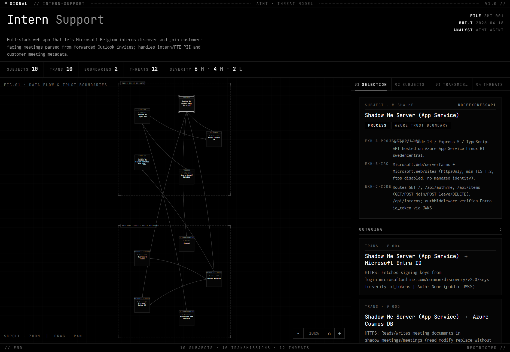

# ATMT - Automated Threat Modeling Tool

ATMT analyzes a repository's architecture and surfaces likely security threats and weaknesses, producing a structured, interactive threat model you can share with reviewers.

## How to use

1. **Install the plugin**: find ATMT on the Agency plugin catalog: <https://vigilant-adventure-v9qpqwn.pages.github.io/all/#plugins/threat-modeling> (Microsoft EMU) and install it into your Copilot / Claude CLI.
2. **Run it**: in chat, ask:
   > Run ATMT on this repo and produce a threat model.
3. **View the report**: once generation completes, open [`./ATMT_Output/threat_model.html`](./threat_model.html) in any browser. Drop the JSON files into the loader if prompted.

## Example

